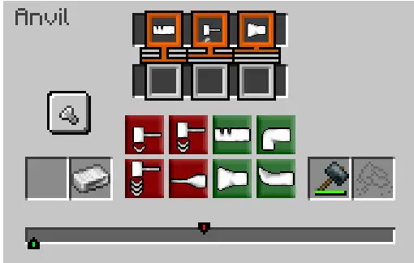

## 问题介绍
铁砧是TFC(群峦)模组中一个很重要的组成，是一种不可避免的合成物品的机制。当你打开一个铁砧时，会出现如下的界面。
  
下面是一个进度条，你需要通过4个红色按钮和4个绿色按钮来将一个金属锭加工成你想要的东西。每一个按钮的会不同程度的将进度条左移或者右移，当进度条中的绿色游标**正好**对准红色目标时，你才会获取物品。只对算法感兴趣的童鞋请跳到 [#算法模型](#算法模型)。当操作次数足够小的时候会有更高的奖励。
## 问题调查
对于我来说，我非常讨厌这种重复性的工作，我希望我可以最省事的做完这样的操作。那么第一件事就是上github上翻番源码，虽然我找到过铁砧的计算器，但是我不是很满意这个算法的实现，那就只好自己调查一下了。首先很快找到TFC repo里跟铁砧有关的代码，很快就找到了这个 `TerraFirmaCraft/src/main/java/net/dries007/tfc/common/recipes/AnvilRecipe.java`。凭借着cpp基础(不是)随便就可以读Java代码不费一点劲。
```java
    public int computeTarget(Inventory inventory)
    {
        return 40 + new XoroshiroRandomSource(inventory.getSeed())
            .forkPositional()
            .fromHashOf(id)
            .nextInt(154 - 2 * 40);
    }

    private boolean isWorkMatched(int work, int target)
    {
        final int leeway = TFCConfig.SERVER.anvilAcceptableWorkRange.get();
        return work >= target - leeway && work <= target + leeway;
    }
```
这是什么意思呢，work,就是那个绿条，你的当前进度，target,就是你的目标进度，我这一看有个leeway,单人里马上就给设置里，从此再也没有被这个问题烦恼过。
但是自从开始玩服务器之后，着就不够里。依照这个`computeTarget`，很明显每一个配方，竟然都是随机生成的。又翻了翻，翻到了`TerraFirmaCraft/src/main/java/net/dries007/tfc/common/capabilities/forge/ForgeStep.java`
```java
public enum ForgeStep
{
    HIT_LIGHT(-3, 53, 50, 128, 224),
    HIT_MEDIUM(-6, 71, 50, 160, 224),
    HIT_HARD(-9, 53, 68, 192, 224),
    DRAW(-15, 71, 68, 224, 224),
    PUNCH(2, 89, 50, 0, 224),
    BEND(7, 107, 50, 32, 224),
    UPSET(13, 89, 68, 64, 224),
    SHRINK(16, 107, 68, 96, 224);
    ...
    ForgeStep(int step, int buttonX, int buttonY, int iconX, int iconY)
    {
        this.step = step;
        this.buttonX = buttonX;
        this.buttonY = buttonY;
        this.iconX = iconX;
        this.iconY = iconY;
    }
    ...
```
我基本上就算全都明白了
## 算法模型
有一序列的操作比如 `[-15, -9, -6, -3, 2, 7, 13, 16]`，你需要操作尽可能少的次数来让这些操作的值之和等于一个定值N。
0 < N < 150
对于有算法竞赛经验的同学来说，这个问题一看就会觉得太熟悉了，这不就是那个硬币问题么，妥妥的dp啊。就算是暴力都能解完吧。
不过对当时的我来说我还不知道什么是dp。
对我经历不感兴趣的请直接跳到[#解法](#解法)。

## 我的第一次尝试
写的其实不是非常工整，因为我需要的是最少的操作次数，那我就想，依照操作次数从低到高的顺序，列出所有的操作算出总和，如果找到了总和对了就停止。
```typescript
let initial_list = [16, 13, 7, 2, -3, -6. - 9, -15]

let target_value = 100;

function reset() {
    return [
        initial_list.map(function (e) {
            return {
                value: e,
                path: [e]
            };
        })
    ];
}

let iterations = reset();

function iterate() {
    let last_iteration = iterations[iterations.length - 1];

    let iteration: {
        value: any;
        path: any[];
    }[] = [];

    initial_list.forEach(element => {
        last_iteration.forEach(it => {
            let value = it.value + element;
            let path = it.path.concat(element);

            if (value == target_value) {
                console.log(path);
                return path;
            }


            if (!last_iteration.find(e => e.value == value))
            ) {
                iteration.push({
                    value: value,
                    path: path
                });
            }
        });
    });

    iteration.sort(elem => Math.abs(elem.value - target_value))
    iterations.push(iteration)
}
```
我在写这段代码的时候感觉到其实有一个更优美更高效的解法，但是这个对我来说，好像差不多够用了。
## 解法
这道题看起来像是一个凑硬币的变体，带上具体路径的变体。但这个问题和dp不一样的地方是硬币的面值不能是负值，这就意味着硬币每加一个，那么总和一定会更多。但在这里面，总和可能会更少。也就可能会出现`dp[99]` > `dp[100]`的情况。  
那这道题是什么呢? 相比于dp,我更愿意把这个东西看成一个 Dijkstra 的题。虽然我在写的时候用的变量名叫做path但是我确实没有意识到这是一个可以用最短路径类的算法来解的题。
